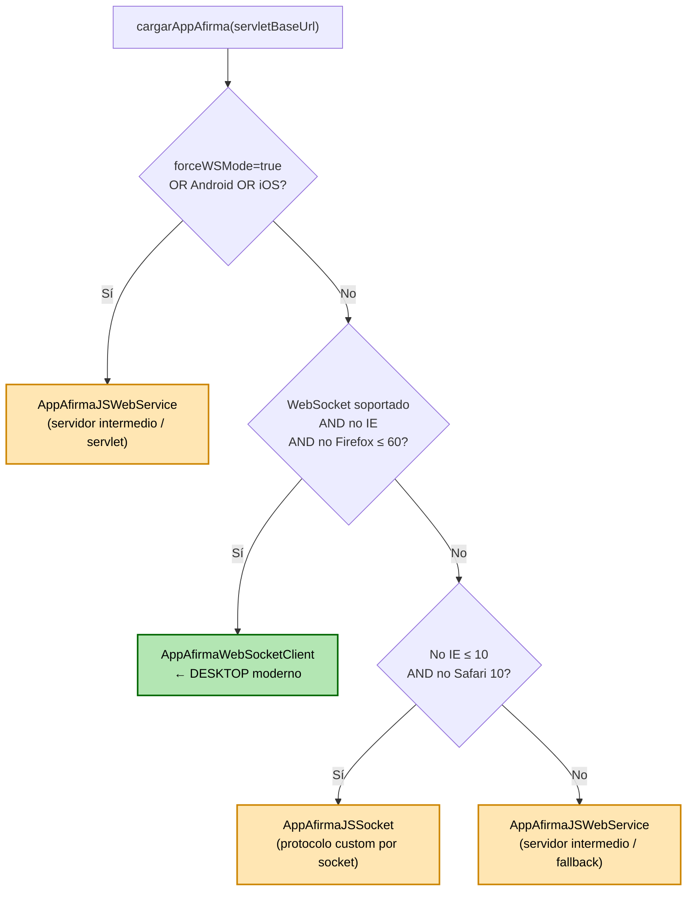
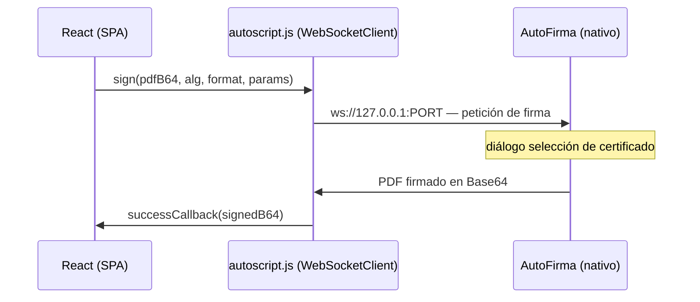
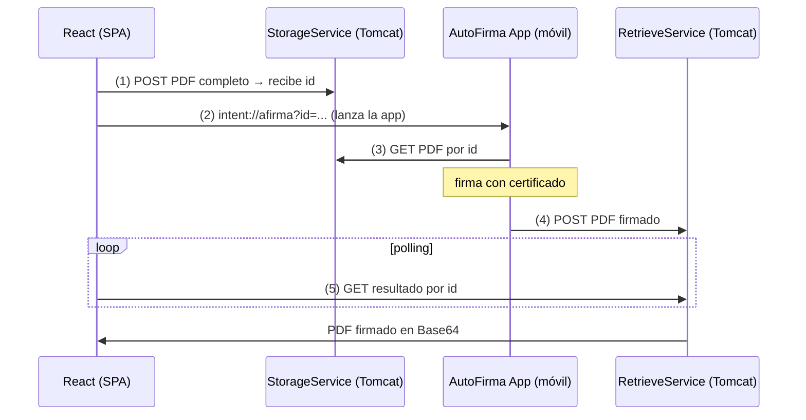
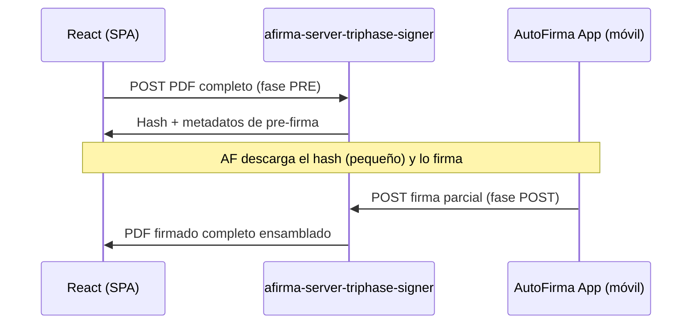
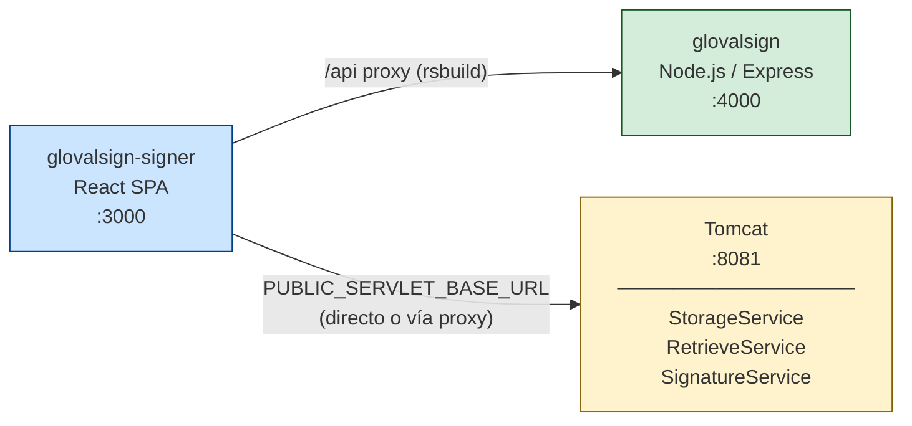

# AutoScript.js — Funcionamiento interno, flujos de comunicación y seguridad

## 1. ¿Qué es autoscript.js?

`autoscript.js` es la librería JavaScript oficial del Ministerio de Hacienda que actúa de **puente entre la página web y la aplicación nativa AutoFirma**. Expone el objeto global `window.AutoScript` (y su alias `window.MiniApplet` por compatibilidad).

Su responsabilidad es única: **detectar el entorno del cliente y elegir el mecanismo de comunicación adecuado** con la aplicación AutoFirma, abstrayendo esa complejidad de la página web.

---

## 2. Árbol de decisión interno de `cargarAppAfirma()`

Cuando llamamos a `AutoScript.cargarAppAfirma(servletBaseUrl)`, la librería sigue este árbol:

En la práctica:

| Dispositivo | Cliente elegido | Protocolo |
|---|---|---|
| Desktop Chrome/Edge/Safari moderno | `AppAfirmaWebSocketClient` | WebSocket local `ws://127.0.0.1:PORT` |
| Desktop Firefox ≤ 60 / IE ≤ 10 | `AppAfirmaJSWebService` | Servlet (servidor intermedio) |
| Android | `AppAfirmaJSWebService` | Servlet (servidor intermedio) |
| iOS | `AppAfirmaJSWebService` | Servlet (servidor intermedio) |

---

## 3. Flujo DESKTOP — WebSocket local

**Paso a paso:**

1. React llama a `AutoScript.sign(pdfBase64, alg, format, params, onSuccess, onError)`
2. autoscript.js crea un WebSocket a `ws://127.0.0.1:PORT` (puerto aleatorio en rango 49152-65534 por defecto; configurable con `setPortRange`)
3. Si la conexión falla tras ~15 reintentos (~30 s), dispara `onError` con el tipo `es.gob.afirma.standalone.afirma5.ws.client.socket.AutoFirmaConnectionException`
4. Si conecta, envía el PDF en Base64 junto con el algoritmo, formato y extraparams
5. AutoFirma muestra su diálogo nativo de selección de certificado
6. El usuario selecciona el certificado → AutoFirma firma → devuelve el PDF firmado en Base64 por el WebSocket
7. autoscript.js llama a `onSuccess(signedPdfBase64)`

**El PDF nunca sale de la máquina del usuario** en este modo.

---

## 4. Flujo MÓVIL — Servidor intermedio (servlet)

El móvil no puede abrir un WebSocket a localhost del servidor. Necesita un intermediario accesible por ambas partes.

**Paso a paso detallado:**

1. **AutoScript sube el PDF** al servlet de almacenamiento (`StorageService`) mediante HTTP POST. El servlet devuelve un `id` de operación.
2. **AutoScript construye una URL de invocación** con esquema `afirma://` (o `intent://` en Android). Esta URL contiene el `id` y las URLs de los servlets. La abre en el navegador o en un iframe.
3. El sistema operativo reconoce el esquema y **lanza la app AutoFirma**. Si la app no está instalada, el OS simplemente ignora la URL (sin error explícito → el modal de instalación puede no dispararse automáticamente).
4. **AutoFirma descarga el PDF** del servlet de almacenamiento usando el `id`.
5. El usuario selecciona certificado, AutoFirma firma el PDF y lo **sube al servlet de recuperación** (`RetrieveService`).
6. **AutoScript hace polling** sobre el servlet de recuperación hasta que encuentra el resultado.
7. AutoScript llama a `onSuccess(signedPdfBase64)`.

### Modo trifásico (`afirma-server-triphase-signer`)

En el modo simple, el PDF completo viaja al servlet y al móvil. El modo trifásico optimiza esto:

Con un PDF de 7.7 MB esto sigue siendo lento si el servlet está en remoto (Cloudflare tunnel), porque el PDF completo sigue viajando hasta el servlet en la fase PRE.

---

## 5. Por qué el modal no aparece automáticamente en Android

Cuando AutoFirma no está instalada en Android:

- El intent `afirma://...` simplemente **no hace nada** o el sistema abre el Play Store
- AutoScript queda esperando en el polling de `RetrieveService` hasta que vence el timeout
- El timeout dispara `onError` con tipo `timeout` → `isNotInstalledError()` debería capturarlo

Sin embargo, en algunos Android, el timeout no llega a producirse porque el polling nunca arranca (la URL de intent se abre en el mismo tab y navega fuera de la SPA). Por eso se añadió el botón manual "¿Cómo instalar AutoFirma?".

---

## 6. Comunicaciones React ↔ Servlet ↔ AutoFirma (resumen de red)

### Modo simple (sin trifásico)

| # | Origen | Destino | Datos | Protocolo |
|---|---|---|---|---|
| 1 | `autoscript.js` (browser) | `StorageService` | PDF completo en Base64 | HTTP POST |
| 2 | App AutoFirma | `StorageService` | - (descarga el PDF) | HTTP GET |
| 3 | App AutoFirma | `RetrieveService` | PDF firmado en Base64 | HTTP POST |
| 4 | `autoscript.js` (browser) | `RetrieveService` | - (polling hasta recibir firma) | HTTP GET repetido |
| 5 | `autoscript.js` (browser) | React callback | PDF firmado en Base64 | Memoria JS |
| 6 | React | Backend (`/api/v1/sign/...`) | PDF firmado en bytes | HTTP POST |

### Modo trifásico

| # | Origen | Destino | Datos | Protocolo |
|---|---|---|---|---|
| 1 | `autoscript.js` (browser) | `afirma-server-triphase-signer` | PDF completo, solicita PRE-firma | HTTP POST |
| 2 | Triphase signer | `autoscript.js` | Hash + metadatos de pre-firma | HTTP response |
| 3 | `autoscript.js` | `StorageService` | Hash + metadatos (pequeño) | HTTP POST |
| 4–6 | igual que modo simple | App firma solo el hash | | |
| 7 | `autoscript.js` | `afirma-server-triphase-signer` | Firma parcial, solicita POST-firma | HTTP POST |
| 8 | Triphase signer | `autoscript.js` | PDF firmado completo | HTTP response |

---

## 7. Implicaciones de seguridad al enviar el PDF al servlet

### Qué viaja por la red

En ambos modos, el **PDF completo** llega al servlet en algún momento:

- **Modo simple**: viaja desde el browser al `StorageService` y desde allí a la app AutoFirma.
- **Modo trifásico**: viaja desde el browser al `afirma-server-triphase-signer` en la fase PRE.

### Riesgos a considerar

| Riesgo | Severidad | Situación actual |
|---|---|---|
| El PDF viaja en claro si el servlet no usa HTTPS | Alta | En local, HTTP. En producción, imprescindible HTTPS en Tomcat o mediante proxy inverso. |
| El servlet almacena temporalmente el PDF | Media | El `StorageService` guarda el PDF en memoria/disco entre el upload y la descarga por AutoFirma. El tiempo de vida es configurable. |
| El servlet está expuesto públicamente | Media | En producción, los servlets deben ser accesibles para AutoFirma (móvil) pero no necesariamente para el público general. Considerar restricciones de IP o autenticación. |
| Manipulación del PDF en el servlet | Alta | Si el servlet es propio y de confianza, el riesgo es bajo. La firma que produce AutoFirma incluye un hash criptográfico del contenido: cualquier modificación posterior invalida la firma. |
| El PDF firmado se expone en el servlet | Media | El `RetrieveService` entrega el PDF firmado a quien tenga el `id` de operación. El `id` actúa como token de un solo uso con TTL corto. |

### Qué protege la firma PAdES

La firma PAdES (PDF Advanced Electronic Signature) garantiza:

- **Integridad**: cualquier modificación del PDF después de firmado invalida la firma digitalmente. El PDF no puede alterarse en el servlet sin que se detecte.
- **No repudio**: la firma está asociada criptográficamente al certificado del firmante.
- **Autenticidad**: el certificado permite verificar la identidad del firmante.

Lo que **no protege**: la confidencialidad del PDF en tránsito (eso es responsabilidad de HTTPS) ni el acceso no autorizado al servlet.

### Recomendaciones para producción

1. **HTTPS obligatorio** entre browser y servlet, y entre AutoFirma y servlet.
2. **TTL corto** en el `StorageService` (configurable en `tps_config.properties`).
3. **Servlet no expuesto en internet** si solo se usa en desktop (WebSocket local); solo necesario en producción con usuarios móviles.
4. **Proxy inverso** (nginx/Apache) delante de Tomcat con TLS terminado en el proxy.
5. Si el PDF contiene datos sensibles, considerar **cifrado a nivel de aplicación** antes de enviarlo al servlet (aunque complica la firma trifásica).

---

## 8. Configuración en este proyecto

El proxy de rsbuild (`AUTOFIRMA_SERVICES_TARGET=http://localhost:8081`) hace que los servlets sean accesibles para el browser en el mismo origen que la SPA, evitando problemas de CORS durante el desarrollo.
