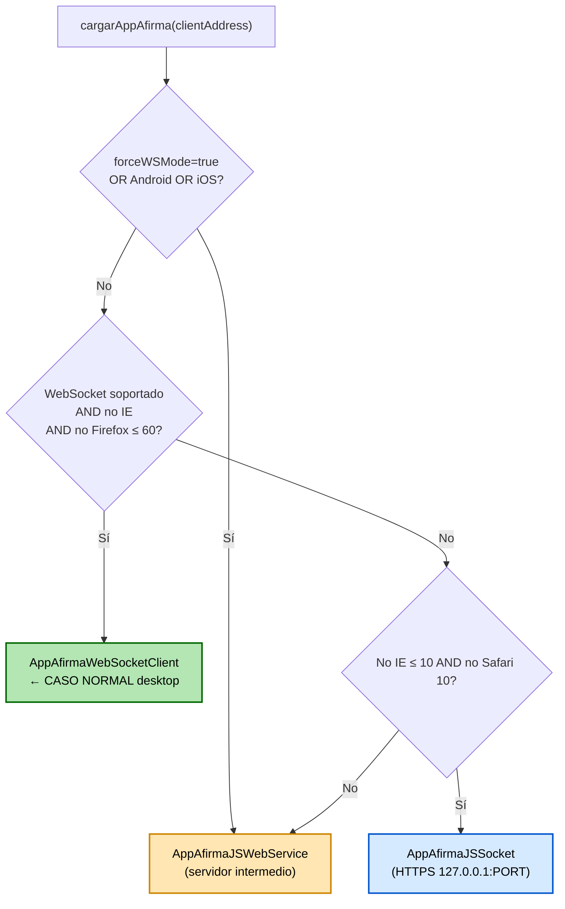
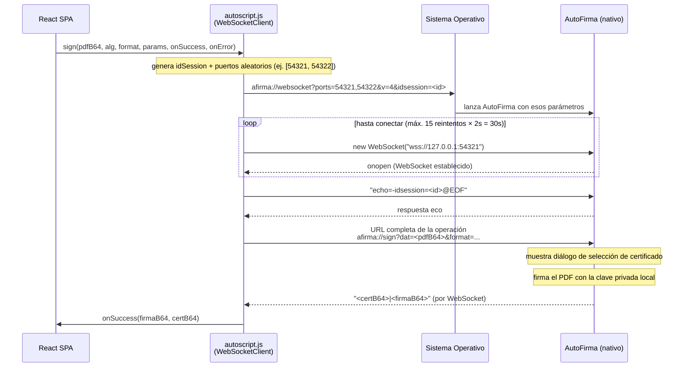
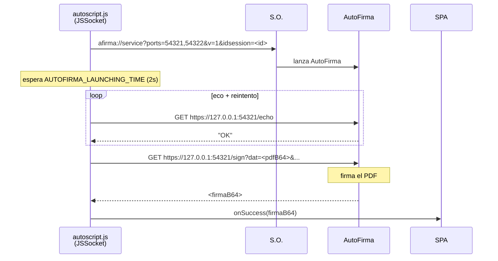
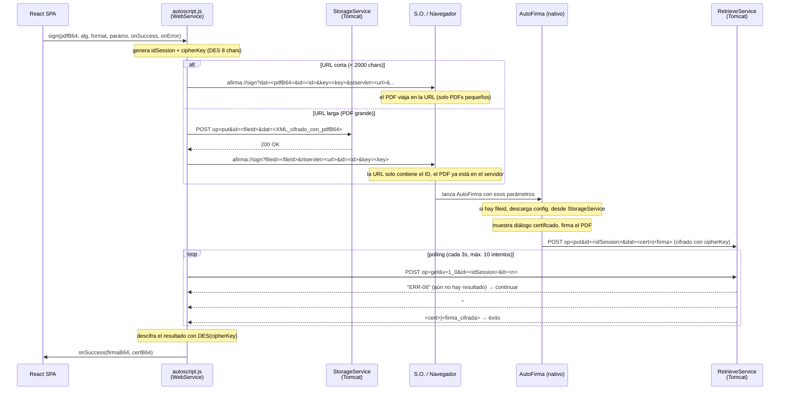
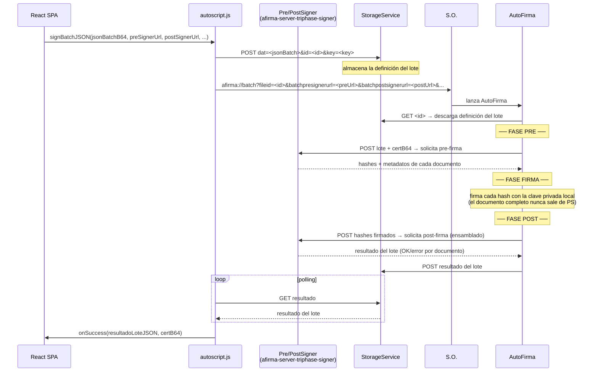

# Arquitectura de comunicación: AutoScript → OS → AutoFirma

## 1. Visión general

```
┌─────────────────────────────────────────────────────────────────┐
│  NAVEGADOR                                                       │
│  ┌────────────┐   ┌──────────────────────────────────────────┐  │
│  │ React SPA  │──▶│ autoscript.js                            │  │
│  └────────────┘   │  detecta entorno y elige cliente:        │  │
│                   │  • AppAfirmaWebSocketClient  (desktop WS) │  │
│                   │  • AppAfirmaJSSocket         (socket TLS) │  │
│                   │  • AppAfirmaJSWebService     (servlet)    │  │
│                   └──────────────┬───────────────────────────┘  │
└──────────────────────────────────│──────────────────────────────┘
                                   │ URL scheme afirma://
                                   ▼
                        ┌──────────────────┐
                        │   Sistema Oper.  │
                        │  (URL handler)   │
                        └────────┬─────────┘
                                 │ lanza proceso
                                 ▼
                        ┌──────────────────┐
                        │   AutoFirma      │
                        │   (nativo)       │
                        └──────────────────┘
```

`autoscript.js` **nunca** firma nada directamente. Su único rol es empaquetar los parámetros y pasárselos a AutoFirma, que es quien accede a los certificados del sistema y realiza la operación criptográfica.

---

## 2. Cómo AutoScript lanza AutoFirma: el protocolo URL scheme

En todos los modos, la invocación a AutoFirma se realiza construyendo una URL con el esquema `afirma://` y navegando a ella:

```
afirma://sign?ver=3&op=sign&id=<sesionId>&key=<cipherKey>
              &format=PAdES&algorithm=SHA512withRSA
              &dat=<PDF_en_Base64_URL_SAFE>
              &stservlet=https://miservidor/StorageService
              &aw=true
```

El parámetro `aw=true` (*active wait*) indica a AutoFirma que cuando termine debe subir el resultado al servlet en lugar de devolvérselo directamente al navegador (que en móvil es imposible).

### Cómo el OS gestiona el scheme

| Plataforma | Mecanismo | Qué ocurre si AutoFirma no está instalada |
|---|---|---|
| **Windows** | Registro de Windows (`HKLM\SOFTWARE\Classes\afirma`) | Nada — la URL simplemente se ignora |
| **macOS** | Launch Services (`.plist` de la app) | Nada / diálogo del sistema |
| **Android** | Intent filter en el `AndroidManifest.xml` de la app | Play Store o nada |
| **iOS** | URL scheme declarado en `Info.plist` | App Store o nada |
| **Linux** | `xdg-open` + entrada `mimeapps.list` o `.desktop` | Nada |

> **Importante:** el navegador no recibe ningún callback del OS si la app no está instalada. AutoScript debe inferirlo por timeout en el polling/WebSocket.

---

## 3. Árbol de decisión de `cargarAppAfirma()`



---

## 4. MODO A — Sin servidor intermedio: WebSocket local

> **Cuándo:** Desktop moderno (Chrome, Edge, Safari ≥ 11, Firefox ≥ 61) que no haya forzado `forceWSMode`.

### Flujo completo



### Características

| Característica | Valor |
|---|---|
| **Protocolo** | WebSocket Secure (`wss://127.0.0.1:PORT`) |
| **Puerto** | Aleatorio en rango 49152–65534 (configurable con `setPortRange`) |
| **Versión protocolo** | 4 |
| **PDF sale de la máquina** | ❌ No |
| **Requiere servidor** | ❌ No |
| **Funciona en móvil** | ❌ No |
| **Reintentos de eco** | 15 intentos × 2 s = 30 s máximo |
| **Retardo inicial** | 3 s para que AutoFirma arranque |

### Formato de la respuesta del WebSocket

```
<certB64UrlSafe>|<firmaB64UrlSafe>
```

O con tres partes si se devuelven datos extra:
```
<certB64UrlSafe>|<firmaB64UrlSafe>|<extraInfoB64UrlSafe>
```

---

## 5. MODO B — Sin servidor intermedio: Socket HTTPS directo (`AppAfirmaJSSocket`)

> **Cuándo:** Navegadores sin WebSocket completo o con problemas de VDI (Firefox 49-60 sin el modo anterior).

Mismo principio que el WebSocket pero usando peticiones HTTPS directas a `https://127.0.0.1:PORT` con fragmentación de URL si la petición es muy grande (>1 MB en Chrome, >458 KB en Firefox, >12 KB en IE).



La diferencia principal respecto al WebSocket es que aquí **no hay conexión persistente**: cada mensaje es una petición HTTP independiente.

---

## 6. MODO C — Con servidor intermedio: Modo simple (monofásico)

> **Cuándo:** Móvil (Android/iOS), IE ≤ 10, `forceWSMode = true`, o desktop como fallback.

El navegador no puede conectarse a `localhost` del dispositivo móvil. Se necesita un **servidor accesible por ambas partes** que actúe de buzón.

### Componentes del servidor intermedio

| Servlet | Función | Endpoint por defecto |
|---|---|---|
| `StorageService` | Almacena temporalmente datos subidos por browser o AutoFirma | `.../afirma-signature-storage/StorageService` |
| `RetrieveService` | Entrega esos datos a quien pregunte con el `id` correcto | `.../afirma-signature-retriever/RetrieveService` |

### Flujo completo — modo simple



### Características del cifrado en tránsito

El resultado que AutoFirma sube al servlet está cifrado con DES-CBC usando `cipherKey`:

```
<padding>.<datoCifradoBase64UrlSafe>
```

`cipherKey` es un número aleatorio de 8 dígitos generado con `crypto.getRandomValues()`. Se envía a AutoFirma en la URL de invocación y se usa en el browser para descifrar. **El servlet nunca conoce la clave.**

### Señales de control del polling

| Respuesta del servlet | Significado | Acción de AutoScript |
|---|---|---|
| `ERR-06` | Todavía no hay resultado | Seguir polling |
| `#WAIT...` | AutoFirma está procesando | Reiniciar contador de intentos |
| `ERR-11:=...` | Operación cancelada por usuario | `errorCallback(AOCancelledOperationException)` |
| `ERR-xx:=...` | Error de AutoFirma | `errorCallback(Exception, mensaje)` |
| `CANCEL` | Cancelación explícita | `errorCallback(AOCancelledOperationException)` |
| `OK` | Operación sin resultado (save) | `successCallback()` |
| `<cert>\|<firma>` | Éxito con datos | `successCallback(firma, cert)` |

---

## 7. MODO D — Con servidor intermedio: Modo trifásico (batch pre/post signer)

> **Cuándo:** Se usa `signBatchXML` o `signBatchJSON` con `batchPreSignerUrl` y `batchPostSignerUrl`.

En el modo simple, **el documento completo** viaja hasta AutoFirma (pasando por el servidor). Con documentos grandes o en producción esto puede ser un cuello de botella. El modo trifásico divide la firma en tres fases:

- **PRE-firma**: el servidor calcula el hash y los metadatos criptográficos del documento.
- **FIRMA**: AutoFirma solo firma el hash (unos pocos bytes), no el documento entero.
- **POST-firma**: el servidor ensambla la firma parcial con el documento original para producir el PDF firmado final.

### Flujo completo — modo trifásico



### Diferencia clave entre modos

```
MODO SIMPLE (monofásico)
  Browser ──[PDF completo]──▶ StorageService ──[PDF]──▶ AutoFirma
  AutoFirma firma el PDF completo localmente
  AutoFirma ──[firma completa]──▶ RetrieveService ──[firma]──▶ Browser

MODO TRIFÁSICO
  Browser ──[definición de lote]──▶ StorageService
  AutoFirma ──[PDF+cert]──▶ PreSigner ──[hash]──▶ AutoFirma
                              ▲                           │
                              └──────[hash firmado]───────┘
  PostSigner ensambla hash firmado + PDF = PDF firmado completo
  AutoFirma ──[resultado lote]──▶ RetrieveService ──▶ Browser
```

---

## 8. Comparativa de modos

| | WebSocket local | Socket HTTPS directo | Servidor intermedio simple | Servidor intermedio trifásico |
|---|---|---|---|---|
| **Clase JS** | `AppAfirmaWebSocketClient` | `AppAfirmaJSSocket` | `AppAfirmaJSWebService` | `AppAfirmaJSWebService` |
| **Protocolo** | WebSocket `wss://127.0.0.1` | HTTPS `https://127.0.0.1` | HTTP(S) + URL scheme | HTTP(S) + URL scheme |
| **Funciona en móvil** | ❌ | ❌ | ✅ | ✅ |
| **PDF viaja por red** | ❌ (todo local) | ❌ (todo local) | ✅ (completo) | ⚠️ (solo hasta PreSigner) |
| **Servidor requerido** | ❌ | ❌ | ✅ Storage + Retrieve | ✅ Storage + Retrieve + PrePost |
| **Documentos grandes** | ✅ (límite RAM local) | ⚠️ (límite URL ≈ 1 MB) | ⚠️ (lento por red) | ✅ (solo hash viaja a AF) |
| **Operaciones en lote** | ✅ (`signBatchJSON`) | ✅ | ✅ | ✅ (diseñado para esto) |
| **Privacidad del doc.** | ✅ Total | ✅ Total | ⚠️ Pasa por servidor | ⚠️ Pasa por PreSigner |
| **Cifrado del resultado** | ❌ (WebSocket local) | ❌ (HTTPS local) | ✅ DES-CBC con cipherKey | ✅ DES-CBC con cipherKey |

---

## 9. Cuándo usa cada modo este proyecto

En `glovalsign-signer` la inicialización es:

```js
// src/utils/autofirmaUtils.js (o similar)
AutoScript.setServlets(storageUrl, retrieverUrl);
AutoScript.cargarAppAfirma(clientAddress);
```

- **Desktop Chrome/Edge/Firefox ≥ 61**: se usa el WebSocket local — el PDF nunca sale del equipo del usuario.
- **Móvil / `forceWSMode`**: se usa el servidor intermedio en modo simple. Los servlets de Storage y Retriever deben ser accesibles tanto desde el navegador como desde la app AutoFirma (en el caso de este proyecto, a través del túnel Cloudflare).
- **Lotes**: `signBatchJSON` usa el modo trifásico si se pasan `batchPreSignerUrl` / `batchPostSignerUrl`.

---

## 10. Detalles del cifrado DES entre browser y servlet

Cuando se usa servidor intermedio, los datos se cifran antes de subirse al servlet:

```
Browser genera: cipherKey = "47291083" (8 dígitos aleatorios)

Datos en claro (XML con params en Base64) ──[DES-CBC, key=cipherKey]──▶ "<padding>.<datosCifradosB64UrlSafe>"

Browser envía al StorageService: op=put&v=1_0&id=<fileId>&dat=<datosCifrados>
Browser envía a AutoFirma en la URL: ...&key=47291083...

AutoFirma descifra los datos con la clave recibida en la URL.
AutoFirma cifra el resultado con la misma clave y lo sube al RetrieveService.
Browser recupera el resultado y lo descifra con su copia de cipherKey.
```

El servlet actúa como buzón ciego: **almacena datos cifrados que no puede leer**.
